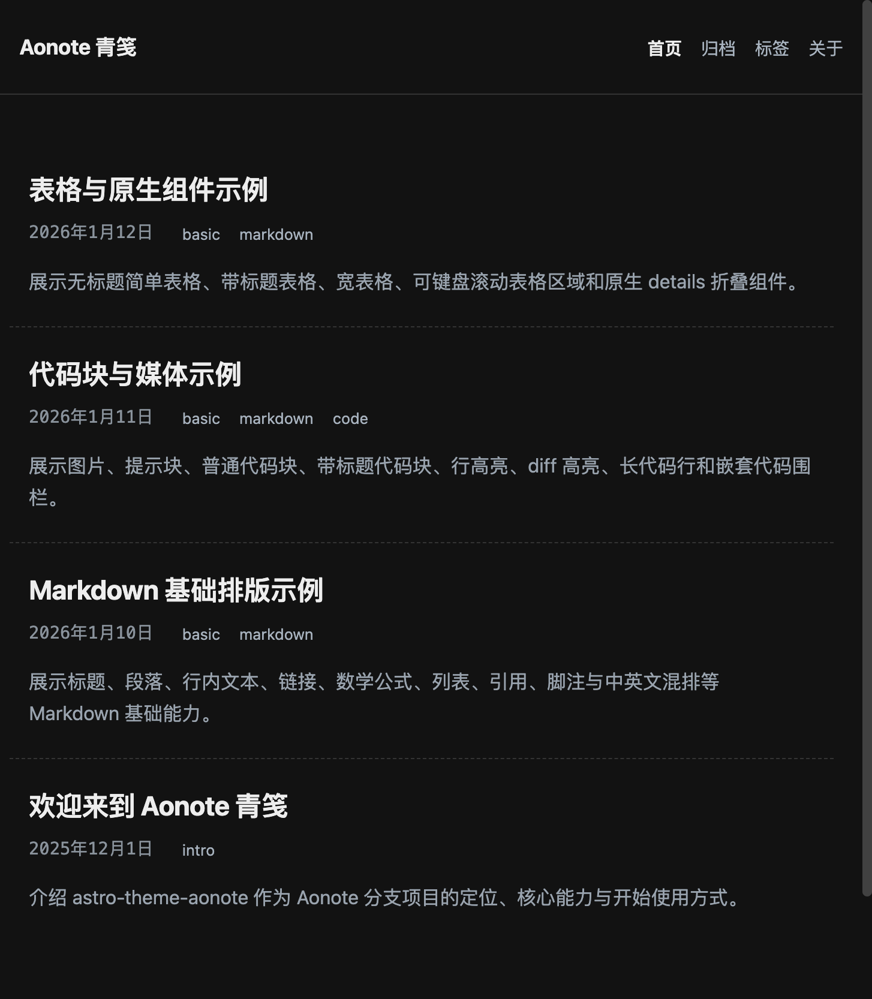
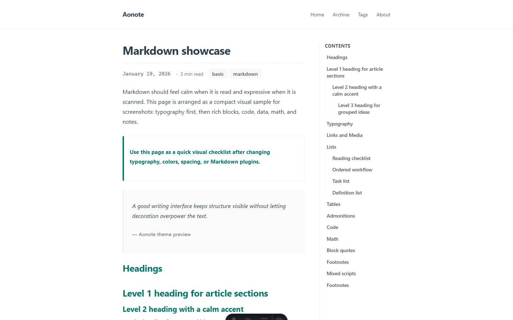

# astro-theme-aonote

English | [中文](README.zh-CN.md)

[](https://astro-theme-aonote.vercel.app)
[](https://astro.build)

**Astro port of [runsli/Aonote](https://github.com/runsli/Aonote)** — same reading experience and content model, built on [Astro](https://astro.build) 5.

| | |
| --- | --- |
| **Live demo** | https://astro-theme-aonote.vercel.app |
| **Upstream** | https://github.com/runsli/Aonote |
| **Ecosystem** | [When to use which](docs/ECOSYSTEM.md) · [中文](docs/ECOSYSTEM.zh-CN.md) · [Full doc](https://aonote.vercel.app/posts/doc-ecosystem/) |

## Screenshots

| Home | Post (TOC, MathML, code) |
| --- | --- |
|  |  |

## Features

- GFM: tables, task lists, footnotes, definition lists, admonitions
- Math as **MathML** (temml), no KaTeX runtime CSS
- Shiki code blocks with Aonote-style metadata (title, line highlight, diff)
- Archive, tags, RSS + Atom, sitemap
- Light / dark theme, zh-CN / en UI strings
- Subpath-aware links when deployed under a repo path

## Quick start

### Use as Astro template (recommended)

```bash
npm create astro@latest my-blog -- --template runsli/astro-theme-aonote
cd my-blog
npm install
npm run dev
```

### Clone this repo

```bash
git clone https://github.com/runsli/astro-theme-aonote.git
cd astro-theme-aonote
npm install
npm run dev
```

Open http://localhost:4321 and edit:

1. `src/site.config.ts` — title, `baseUrl`, language, copyright
2. `src/content/posts/` — your Markdown posts
3. `src/content/pages/about.md` — about page

**Node:** ≥ 18.20.8 (Astro 5). Node 22 LTS is recommended.

## Deploy

[](https://vercel.com/new/clone?repository-url=https%3A%2F%2Fgithub.com%2Frunsli%2Fastro-theme-aonote)

After deploy, set `baseUrl` in `src/site.config.ts` to your production URL. See [docs/GITHUB_TEMPLATE.md](docs/GITHUB_TEMPLATE.md) for Vercel/Netlify steps and enabling **GitHub Template repository**.

## Customize

| What | Where |
| --- | --- |
| Site title, URL, locale | `src/site.config.ts` |
| UI strings | `src/i18n.ts` |
| Global layout / nav | `src/layouts/BaseLayout.astro` |
| Theme CSS | `src/styles/aonote.css` |
| Markdown pipeline | `src/integrations/aonote-markdown.ts` |
| Feed limits | `src/utils/feed.ts` |

## Upstream mapping

| Upstream (Python) | This repo (Astro) |
| --- | --- |
| `config.py` | `src/site.config.ts` |
| `markdown/` | `src/content/posts/` |
| `templates/base.html` | `src/layouts/BaseLayout.astro` |
| `assets/style.css` | `src/styles/aonote.css` |
| `i18n.py` | `src/i18n.ts` |
| `_site/` | `dist/` |

## Project layout

```text
src/
├── site.config.ts
├── content/
│   ├── posts/          # Blog articles
│   └── pages/          # about, 404
├── layouts/
├── components/
├── pages/              # Routes
├── integrations/       # Markdown / Shiki
└── styles/aonote.css
```

## Scripts

| Command | Action |
| --- | --- |
| `npm run dev` | Dev server |
| `npm run build` | Production build → `dist/` |
| `npm run preview` | Preview build |
| `npm run check` | `astro check` |

## Publishing checklist

1. Clean sample content, polish README (this file)
2. Deploy demo → enable **Template repository** on GitHub ([guide](docs/GITHUB_TEMPLATE.md))
3. Smoke-test: `npm create astro@latest -- --template runsli/astro-theme-aonote`
4. Share in Discussions / Discord ([copy-paste text](docs/SHOWCASE.md))
5. Optional later: [Astro themes](https://astro.build/themes/) or npm package

## Contributing

See [CONTRIBUTING.md](CONTRIBUTING.md).

## License

MIT — see [LICENSE](LICENSE). Original Aonote design and styles © [runsli](https://github.com/runsli).
